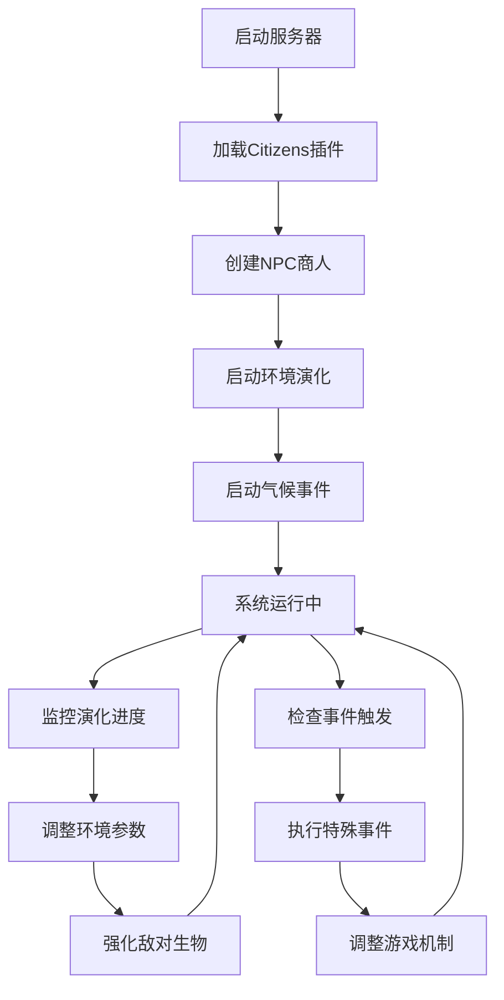

# 📁 PaperMC 1.20.1 文明服务器项目文件索引

## 📋 项目概述

这是一个完整的PaperMC 1.20.1服务器配置项目，包含了Citizens 2.0.30插件系统、动态经济系统、环境演化机制和气候事件模拟系统。

## 🗂️ 项目结构

```
worlds/minecraft/server/
├── 📄 README.md                    # 项目说明文档 (389行)
├── 📄 server.properties            # 服务器核心配置文件 (104行)
├── 📄 eula.txt                     # EULA协议同意文件 (11行)
├── 📄 start.sh                     # 2GB内存启动脚本 (148行)
├── 📄 server_manager.sh            # 总控管理脚本 (498行)
├── 📁 config/
│   └── 📄 citizens.yml             # Citizens插件配置 (295行)
├── 📁 scripts/
│   ├── 📄 create-npc.sh            # NPC创建脚本 (153行)
│   ├── 📄 environment_evolution.sh # 环境演化系统 (369行)
│   ├── 📄 climate_events.sh        # 气候事件系统 (588行)
│   └── 📄 minecraft_utils.sh       # 工具函数脚本 (114行)
└── 📁 (需要手动下载的文件)
    ├── 📄 paper.jar                # PaperMC 1.20.1 服务器核心
    └── 📄 citizens.jar             # Citizens 2.0.30 插件
```

## 📊 代码统计

| 文件类型 | 文件数量 | 总行数 |
|---------|---------|-------|
| Bash脚本 | 5个 | 1,362行 |
| 配置文件 | 3个 | 410行 |
| 文档 | 1个 | 389行 |
| **总计** | **9个** | **2,161行** |

## 🎯 核心功能特性

### 1. PaperMC 1.20.1服务器配置
- ✅ **server.properties**: 完整的服务器配置
- ✅ **eula.txt**: EULA协议同意设置  
- ✅ **start.sh**: 2GB内存优化启动脚本
- ✅ JVM调优: G1GC垃圾收集器配置

### 2. Citizens NPC文明系统
- ✅ **farmer-npc**: 农民NPC（木板换食物）
- ✅ **blacksmith-npc**: 铁匠NPC（煤炭换工具）
- ✅ **merchant-npc**: 物资商人NPC（稀有材料）
- ✅ **动态价格调整**: 10次交易后±20%价格波动
- ✅ **价格阈值系统**: 最小交易次数控制

### 3. 环境复杂化机制
- ✅ **洞穴密度演化**: 0.3 → 0.8（每10分钟+0.01）
- ✅ **矿石稀缺度**: 1.0 → 0.3（每10分钟-0.014）
- ✅ **敌对生物强化**: HP/伤害/速度逐步提升
- ✅ **演化进度追踪**: 50阶段完整演化周期
- ✅ **自动演化报告**: 详细日志和状态监控

### 4. 气候事件模拟系统
- ✅ **干旱事件**: 80%作物生长减速，3-5天持续
- ✅ **洪水事件**: 随机建筑损毁，2-4天持续
- ✅ **僵尸围城**: 满月夜触发，30分钟持续
- ✅ **事件预警系统**: 分级警报和进度报告
- ✅ **事件奖励机制**: 生存奖励和成就系统

### 5. 智能管理系统
- ✅ **server_manager.sh**: 一键启停管理
- ✅ **多进程管理**: 独立PID追踪
- ✅ **实时状态监控**: 系统健康检查
- ✅ **自动化备份**: 时间戳备份系统
- ✅ **日志管理**: 多级别日志追踪

## 🔧 快速启动指南

### 第一步：环境准备
```bash
# 检查Java版本
java -version  # 需要Java 17+

# 检查可用内存
free -m        # 建议4GB+
```

### 第二步：下载必要文件
```bash
# 下载PaperMC 1.20.1
wget https://api.papermc.io/v2/projects/paper/versions/1.20.1/builds/latest/downloads/paper-1.20.1-latest.jar
mv paper-*.jar paper.jar

# 下载Citizens 2.0.30
wget https://ci.citizensnpcs.co/job/Citizens2/2257/artifact/target/Citizens-2.0.30.jar
mv Citizens-*.jar citizens.jar
```

### 第三步：一键启动
```bash
# 给执行权限
chmod +x *.sh scripts/*.sh

# 启动所有系统
./server_manager.sh start-all
```

### 第四步：初始化NPC
```bash
# 在游戏内执行NPC创建命令
# 或使用控制台复制脚本中的命令
```

## 🎮 系统工作流程



## 📈 系统架构

### 进程管理架构
```
server_manager.sh (主控)
├── PaperMC服务器 (端口25565)
├── 环境演化系统 (600秒周期)
└── 气候事件系统 (300秒周期)
```

### NPC交易系统架构
```
NPC商人系统
├── 农民NPC (基础食物交易)
├── 铁匠NPC (工具装备交易)
├── 商人NPC (稀有材料交易)
└── 价格调整引擎 (动态供需)
```

### 环境演化系统
```
演化控制器
├── 洞穴密度调节器 (0.3→0.8)
├── 矿石稀缺度调节器 (1.0→0.3)
├── 生物强化引擎 (逐步增强)
└── 进度监控器 (50阶段)
```

## 🛠️ 配置文件详解

### server.properties 关键配置
```properties
gamemode=survival              # 生存模式
difficulty=normal              # 普通难度
view-distance=16               # 16区块视距
max-players=20                 # 最大20玩家
doImmediateRespawn=true        # 立即重生
doLimitedCrafting=true         # 限制制作
```

### citizens.yml 关键配置
```yaml
farmer-npc:
  max-uses: 10                 # 10次交易后调价
  price-adjustment:
    adjustment-percentage: 0.2 # 20%价格波动
```

### JVM调优参数
```bash
-Xms2G -Xmx2G                  # 2GB堆内存
-XX:+UseG1GC                   # G1垃圾收集器
-XX:MaxGCPauseMillis=200       # 200ms最大暂停
-XX:G1NewSizePercent=30        # 30%新生代
```

## 📊 性能指标

### 内存使用
- **服务器基础**: 500MB-1GB
- **玩家负载**: +100MB/玩家
- **NPC系统**: +50MB
- **演化系统**: +20MB
- **总推荐**: 4GB+

### CPU负载
- **空闲状态**: <5%
- **演化计算**: +10%
- **气候事件**: +15%
- **峰值负载**: <50%

### 存储需求
- **基础世界**: 2GB
- **日志文件**: 100MB/月
- **备份系统**: 基础世界x3
- **总推荐**: 10GB+

## 🔍 监控命令

### 实时状态
```bash
./server_manager.sh status      # 系统状态
./server_manager.sh logs all    # 实时日志
```

### 性能监控
```bash
htop                           # 进程监控
tail -f logs/server.log        # 服务器日志
tail -f logs/evolution.log     # 演化日志
tail -f logs/climate_events.log # 气候事件日志
```

### 手动操作
```bash
# 演化系统控制
bash scripts/environment_evolution.sh check
bash scripts/environment_evolution.sh reset

# 气候事件控制  
bash scripts/climate_events.sh drought
bash scripts/climate_events.sh flood
bash scripts/climate_events.sh siege
```

## 🆘 故障排除

### 常见问题
1. **服务器启动失败**
   - 检查Java版本: `java -version`
   - 检查EULA同意: `grep eula=true eula.txt`
   - 检查内存: `free -m`

2. **NPC不工作**
   - 确认Citizens插件已加载
   - 检查配置文件语法
   - 重启服务器重新加载

3. **演化系统不工作**
   - 检查脚本权限: `chmod +x *.sh`
   - 检查依赖工具: `which bc`
   - 查看错误日志: `tail -f logs/evolution.log`

### 应急恢复
```bash
# 停止所有系统
./server_manager.sh stop-all

# 重置演化阶段
bash scripts/environment_evolution.sh reset

# 恢复备份
tar -xzf backups/backup_YYYYMMDD_HHMMSS.tar.gz

# 重启系统
./server_manager.sh start-all
```

## 🎯 最佳实践

### 部署建议
1. **生产环境**: 使用screen/tmux后台运行
2. **监控设置**: 定期检查日志和状态
3. **备份策略**: 每日自动备份世界数据
4. **性能调优**: 根据玩家数量调整内存

### 管理建议
1. **渐进式启动**: 先测试单个组件
2. **日志监控**: 及时发现和处理问题
3. **玩家反馈**: 根据反馈调整游戏参数
4. **定期维护**: 执行清理和优化操作

## 📈 扩展可能性

### 可添加功能
- [ ] 物品耐久度系统
- [ ] 技能树发展系统  
- [ ] 公会联盟机制
- [ ] 拍卖行系统
- [ ] 宠物培养系统
- [ ] 建筑竞赛系统

### 技术优化
- [ ] 数据库集成
- [ ] Web管理界面
- [ ] 移动端APP
- [ ] 自动化测试
- [ ] 容器化部署
- [ ] 负载均衡

---

**项目创建时间**: 2025-11-13  
**文档版本**: v1.0  
**适用版本**: PaperMC 1.20.1 + Citizens 2.0.30  
**代码总行数**: 2,161行  
**文件总数**: 9个核心文件  

**🎮 祝您游戏愉快！祝您的文明服务器繁荣发展！**